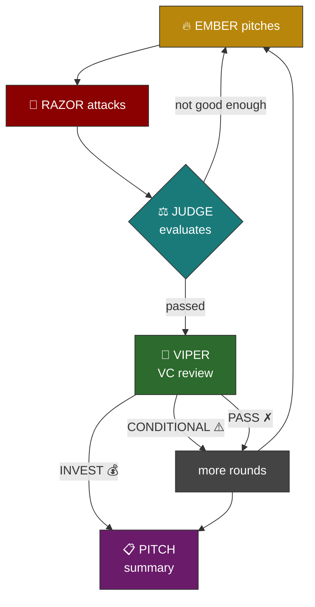

<div align="center">

# SPAR

5 AI agents beat the shit out of your ideas until a real gem survives.

Then a VC tries to kill it.

[](https://www.python.org/downloads/)
[](https://claude.ai/code)
[](LICENSE)

</div>

---

You type a half-baked idea. Two agents fight over it for 12 rounds with live web research. One builds, one destroys. A judge with impossible standards decides when it's good enough. If it passes, a VC does full due diligence and tries to kill it again. At the end you get a summary you can actually use.

Works with Claude Max (no API key needed) or an Anthropic API key. All agents run on Opus with extended thinking.

## Agents

| | Name | What it does | When |
|---|---|---|---|
| 🔥 | EMBER | Pitches, researches, evolves. Kills its own ideas when they're dead. | First every round |
| 🔪 | RAZOR | Finds the competitors you missed. Finds the company that tried this and died. | Second every round |
| ⚖️ | JUDGE | Binary pass/fail gates. Can't be charmed. GARBAGE through FUCKING BRILLIANT. | Every 2 rounds |
| 🐍 | VIPER | Writes a check or walks. 8-point due diligence with web research. | After judge passes |
| 📋 | PITCH | Compresses everything into one page. Dead ideas, survivor, what to do Monday. | End |

## Flow



The judge won't give FUCKING BRILLIANT unless every gate passes: a real person (not a market report) has to have expressed the pain, RAZOR has to have tried and failed to kill it, the 18-month plan has to be modeled, the moat has to survive a stress test. There are nine gates total. Miss one, you stay at STRONG.

## Setup

You need Python 3.10+ and [Claude Code](https://claude.ai/code) installed.

Log in to Claude Code once (opens a browser):

```bash
claude
```

Or set an API key instead:

```bash
export ANTHROPIC_API_KEY="sk-ant-..."
```

Then:

```bash
git clone https://github.com/sofianedjerbi/spar.git
cd spar
pip install claude-agent-sdk rich
```

That's the whole setup.

## Run it

```bash
python spar.py "your idea here"
```

Defaults to 12 rounds. Won't stop until the judge says FUCKING BRILLIANT or the rounds run out. If an idea passes, the VC gets 2 chances to reject and send it back for more work.

```bash
python spar.py "your idea" --rounds 20          # longer session
python spar.py "your idea" --min-verdict strong  # stop at STRONG instead
python spar.py "your idea" --vc-rounds 4         # more VC rejection cycles
```

Transcripts go to `sparring_sessions/` with timestamps.

## Edit the agents

Each agent is a markdown file in `prompts/`. Change the personality, the rules, the gates, whatever. No code to touch.

```
prompts/
├── research_protocol.md   # shared research rules, injected into EMBER/RAZOR/VIPER
├── ember.md
├── razor.md
├── judge.md
├── viper.md
└── pitch.md
```

`{RESEARCH_PROTOCOL}` in any prompt file gets replaced with `research_protocol.md` at runtime.

## What a session actually looks like

Ran "devops business idea in finance" for 12 rounds. Eight ideas died:

- DevOps consulting — race to the bottom with offshore shops
- Trading infra — need $50M+ and FPGA hardware to compete
- Compliance SaaS — Checkov and six funded companies already there
- DORA services — bank procurement takes a year, and DORA applies to you too
- GPU cost gate — Kubecost, CAST AI, Sedai shipped it already
- Trading CI/CD — Blankly built this exact thing, went dormant
- Bot monitoring — KillSwitch.in and ALGOGENE already exist
- AI governance — different career entirely

What survived: a compliance infrastructure implementation practice. $6-10K per engagement, bridging the 40-50% gap between what Vanta automates and what auditors require for custom fintech systems. Validated through Upwork demand (74 active gigs) and an EIM Services case study.

Verdict was STRONG. Missed BRILLIANT because EMBER never addressed the hiring plan or what happens if you discover a breach during an engagement. The judge asked four times. EMBER dodged it four times.

## Why this works

Brainstorming accumulates enthusiasm. This accumulates evidence.

Both agents do web searches every round. They cite real companies, real pricing pages, real G2 reviews, real enforcement actions. When RAZOR said Blankly was dead, EMBER went to the actual GitHub repo and the actual website to check. When RAZOR said Vanta's AI would close the gap, EMBER pulled Vanta's February 2026 release notes and showed zero custom infrastructure features shipped.

The judge tracks which gates pass and which don't across rounds. If the same issue goes unaddressed for two rounds, the verdict gets downgraded. Standing still is moving backwards.

## License

MIT
