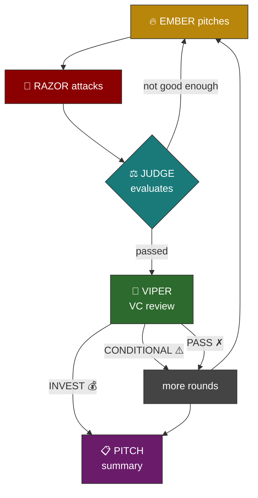

<div align="center">

# SPAR

5 AI agents beat the shit out of your ideas until a real gem survives.

Then a VC tries to kill it.

[](https://www.python.org/downloads/)
[](https://claude.ai/code)
[](LICENSE)

</div>

---

You throw in an idea (startup, career move, whatever). Two agents fight over it with live web research. One builds, one destroys. A judge with impossible standards decides when it's good enough. If it passes, a VC does due diligence. At the end you get a one-page summary with dead ideas, the survivor, and what to do Monday.

Not just startups. Career decisions, side projects, life plans. Anything you want pressure-tested against real evidence instead of vibes.

Works with Claude Max (no API key) or an Anthropic API key. All agents run on Opus with extended thinking.

## The agents

| | Name | What it does | When |
|---|---|---|---|
| 🔥 | EMBER | Pitches, researches, evolves. Kills its own ideas when they're dead. | First every round |
| 🔪 | RAZOR | Finds the competitors you missed. Finds the company that tried this and died. | Second every round |
| ⚖️ | JUDGE | Binary pass/fail gates. Can't be charmed. GARBAGE through FUCKING BRILLIANT. | Every 2 rounds |
| 🐍 | VIPER | Writes a check or walks. 8-point due diligence with web research. | After judge passes |
| 📋 | PITCH | Compresses everything into one page. Dead ideas, survivor, what to do Monday. | End |

## How it flows



The judge has nine binary gates for its top verdict. A real person has to have expressed the pain (market reports don't count), RAZOR has to have tried and failed to kill it, the moat has to survive stress-testing, the 18-month plan has to be modeled. Miss one gate, you stay at STRONG.

## Setup

Python 3.10+ and [Claude Code](https://claude.ai/code).

```bash
git clone https://github.com/sofianedjerbi/spar.git
cd spar
pip install claude-agent-sdk rich
```

Authenticate Claude Code once (Max subscription or API key):

```bash
claude                              # browser login for Max
# or
export ANTHROPIC_API_KEY="sk-ant-..." # API key
```

Done.

## Usage

```bash
# throw in an idea
python spar.py "your idea here"

# or paste a long prompt interactively
python spar.py

# quick validation: 4 rounds, stops at STRONG
python spar.py --quick "rebate tracker for distributors"

# tweak the session
python spar.py "idea" --rounds 20           # longer fight
python spar.py "idea" --min-verdict strong  # stop at STRONG
python spar.py "idea" --vc-rounds 4         # more VC rejection cycles
python spar.py "idea" --name "rebate-v2"    # name the session file
```

### After a session

```bash
# list all past sessions
python spar.py --list

# ask follow-up questions about the latest session
python spar.py --ask "what could be improved?"
python spar.py --ask "how would you monetize this differently?"

# ask about an older session
python spar.py --ask "compare this to the latest" --session 2

# continue a session that ended at STRONG (adds 4 more rounds)
python spar.py --resume
python spar.py --resume --rounds 8          # more rounds
python spar.py --resume --session 2         # resume an older session
```

Transcripts save to `sparring_sessions/` with timestamps. Elapsed time shows at the end of each session.

## Edit the agents

Each agent is a markdown file. Change personalities, rules, gates. No code to touch.

```
prompts/
├── research_protocol.md   # shared research budget + workflow
├── ember.md               # builder
├── razor.md               # destroyer
├── judge.md               # gatekeeper + hard gates
├── viper.md               # VC due diligence
└── pitch.md               # final summary format
```

Want a harsher judge? Edit `judge.md`. Want RAZOR to focus on unit economics? Edit `razor.md`. `{RESEARCH_PROTOCOL}` in any file gets replaced with `research_protocol.md` at runtime.

## What actually happens

**Startup ideas (20 rounds, 9 dead, 1 survivor):**

Told it to go find unsolved pain points on its own. It searched Reddit, HN, G2 reviews. Nine ideas died because the destroyer found a funded competitor every time. Agency content tools (10+ incumbents), scope creep billing (Ignition at $330M), machine shop quoting (Paperless Parts at $51M), equipment rental analytics (Point-of-Rental shipped it 18 days before the pitch).

The one that survived: a $49/mo rebate tracker for wholesale distributors still using Excel. 52% don't collect all earned rebates. One distributor found $300K in missing money. The only competitor costs $20K+/year. Boring. Probably real.

**Career decisions (8 rounds):**

Fed it a career plan (relocating, salary negotiation, freelance transition timeline). The agents researched actual market rates, tax structures by region, employer margins, and told the person their freelance rate target was below market with the credentials they had. Cited specific salary databases and tax rates.

**The agents fact-check each other.** In one session RAZOR claimed a company was dead. EMBER went to the actual GitHub repo and website to verify. Still alive. RAZOR had fabricated evidence. In another session EMBER faked a statistic. RAZOR caught it by fetching the source and showing the number wasn't there.

## Why it works

Brainstorming accumulates enthusiasm. This accumulates evidence.

Every claim gets searched. The judge tracks which issues go unaddressed. If the same gap persists for two rounds, the verdict gets downgraded. Standing still means moving backwards. The agents get 20 web searches per round and 10K tokens of extended thinking. They run on Opus.

## License

MIT
